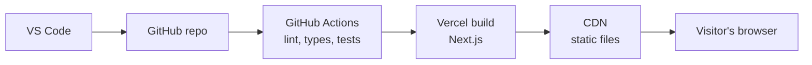

# Architecture

Status: Phase 1 complete. Related: [README](../README.md)

## 1. Overview
The portfolio is a static website. Pages are generated at build time by Next.js, then served as plain files from a CDN. There is no server logic and no database. Every push to `main` is checked by automated tests and then deployed.



## 2. Tech stack

| Layer | Choice | Why |
|---|---|---|
| Framework | Next.js with React | Widely used in startups, file-based routing, good SEO |
| Language | TypeScript (strict) | Catches mistakes before the site runs |
| Styling | Tailwind CSS | Fast to write, theme tokens for light and dark |
| Unit and component tests | Vitest | Fast, works well with TypeScript |
| End-to-end tests | Playwright | Real browser tests, including mobile viewports |
| Accessibility | axe | Automated accessibility checks |
| Code quality | ESLint and Prettier | Consistent code, enforced automatically |
| CI | GitHub Actions | Runs checks on every push and pull request |
| Hosting | Vercel (free plan) | Deploys from GitHub, preview link per pull request |

## 3. Decisions

### Static site vs server-rendered site
- Context: The portfolio has no logins and no user-submitted data. Its content only changes when I edit it.
- Decision: Build it as a static site.
- Why: Nothing is computed per visitor, so no server or database is needed. It is fast, free to host and has very little to attack.
- Alternatives considered: A server-rendered site (needs a running server for no benefit) and a site with a database (nothing to store).

### Where the resume is stored
- Context: Recruiters need to download my resume in one click.
- Decision: Keep the resume as a PDF in `public/` and link to it.
- Why: It is versioned in Git, served by the CDN, and needs no backend.
- Alternatives considered: A Google Drive link (I don't control it and it can break) and cloud storage with a database (more than one file needs).

### Where the site content lives
- Context: Projects and skills will change over time.
- Decision: Keep them in typed data files, separate from the UI components.
- Why: Adding a project means editing data, not UI code, and TypeScript catches mistakes.
- Alternatives considered: A CMS (overkill for one editor) and content written inside components (hard to maintain).

### How skills are placed in the tree
- Context: The tree has branches inside branches, for example Development, then Languages, then C++.
- Decision: Each skill stores its place as a path in one field, such as `Development/Languages`.
- Why: One flat list is easy to edit and validate, and a third level needs no change to the data shape.
- Alternatives considered: A nested object (harder to edit and test) and separate category and group fields (breaks at a third level).


## 4. Build time or browser?

| Feature | Where it runs | Why |
|---|---|---|
| Hero text | Build time | The same for every visitor |
| Project cards (content) | Build time | Comes from data files |
| Skill tree structure | Build time | Built from data once, then shipped as HTML |
| Skill tree expand and collapse | Browser | Responds to clicks |
| Project filter by tag | Browser | Responds to the visitor's selection |
| Light and dark theme toggle | Browser | Depends on the visitor's choice and device setting |
| Copy-email button | Browser | The clipboard needs a click from the visitor |
| Resume download link | Build time | A plain link to a file in `public/` |

## 5. Content data

### Profile
| Field | Required or optional | Why |
|---|---|---|
| name | Required | Shown in the hero |
| headline | Required | QA Engineer, SDET and Software Developer |
| email | Required | Copy-email button and contact section |
| githubUrl | Required | Engineers go here first |
| linkedinUrl | Required | Recruiters expect it |
| youtubeUrl | Optional | Supports the teaching section |
| resumePath | Required | The PDF in `public/` |

### Project
| Field | Required or optional | Why |
|---|---|---|
| id | Required | A unique short name, used to link skills to projects |
| title | Required | The card needs a name to show |
| description | Required | One or two lines, so a skimming recruiter gets the point |
| tags | Required | At least one. Allowed values: `Testing`, `Development` |
| stack | Required | Recruiters scan for tools like Selenium or Java |
| codeUrl | Required | An engineer can reach the code in one click |
| demoUrl | Optional | Many test-automation projects have nothing to demo |
| image | Optional | The card uses a plain placeholder, which keeps the page light |

### Skill
| Field | Required or optional | Why |
|---|---|---|
| name | Required | What the tree node displays |
| level | Required | One of `learning`, `working`, `comfortable`. Shown as "Learning now", "Working knowledge" and "Comfortable" |
| path | Required | Where the skill sits, for example `Testing` or `Development/Languages` |
| evidence | Optional | The ids of projects that prove the skill |

**Turning paths into branches:** split each skill's `path` on `/`, then walk down from the root, creating a branch for any segment that does not exist yet. Attach the skill to the last branch. The result is a nested tree, built once at build time.

## 6. Folder structure

```
portfolio/
├── app/                  pages and layout
├── components/           reusable UI pieces
├── content/              profile, projects and skills data, plus their types
├── lib/                  small pure functions with no UI
├── public/               resume PDF, images, favicon
├── tests/                unit and end-to-end tests
├── docs/                 this document
└── .github/workflows/    CI pipeline
```

| Item | Folder | Why |
|---|---|---|
| Function that builds the tree from skill paths | lib/ | Pure logic with no UI, easy to unit test |
| Function that filters projects by tag | lib/ | Pure logic with no UI |
| SkillTree component | components/ | It displays the branches |
| Projects list, skills list, profile | content/ | Plain data |
| TypeScript types for the data | content/ | Sit next to the data they describe |
| resume.pdf | public/ | Served as a file, unchanged |
| Playwright tests | tests/ | End-to-end tests live together |
| GitHub Actions workflow | .github/workflows/ | GitHub only reads workflows from there |

Rule: dependencies point one way, from `app` to `components` to `lib` and `content`. For example, `content` never imports a component.

## 7. Components

| Component | Job | Receives | Runs in |
|---|---|---|---|
| Header | Logo, navigation links, theme toggle | none | Build time |
| ThemeToggle | Switches light and dark, remembers the choice | none | Browser |
| Hero | Name, headline, links to projects and resume | profile | Build time |
| SkillTree | Nested skill branches with expand and collapse | skills | Browser |
| SkillNode | One skill with its name and level dot | skill | Browser |
| ProjectFilter | The tag buttons | tags, selected tag | Browser |
| ProjectCard | One project | project | Build time |
| TestingSection | How I test this site and what I test in general | none | Build time |
| LearningSection | What I am learning, plus the YouTube channel | profile | Build time |
| Contact | Copy email, social links, resume download | profile | Browser |
| Footer | Short closing line | none | Build time |

## 8. Page layout
A single page with anchored sections, in this order: Header, Hero, Skills, Projects, Testing approach, Learning and teaching, Contact, Footer. On a phone the layout is one column and the header navigation collapses into a menu. On desktop the content has a maximum width of 960px, and project cards sit in a responsive grid.

## 9. Design tokens

Tokens are named by purpose, not by appearance. Components use these names only, never raw hex values, so a theme change happens in one place.

### Colour

| Token | Light | Dark | Used for |
|---|---|---|---|
| `bg` | `#F4F6F8` | `#0E1620` | Page background |
| `surface` | `#FFFFFF` | `#16212D` | Cards, panels, skill tree |
| `text` | `#13202C` | `#E7EEF4` | Main text |
| `text-muted` | `#5A6B7A` | `#93A4B4` | Secondary text |
| `border` | `#D5DDE4` | `#26364A` | Dividers and card outlines |
| `border-control` | `#8A9AA8` | `#4A5F75` | Buttons, toggles and filter chips |
| `accent` | `#0B6E8E` | `#4FB8D6` | Links, primary buttons, highlights |
| `on-accent` | `#FFFFFF` | `#0E1620` | Text placed on an accent background |
| `focus-ring` | `#0B6E8E` | `#4FB8D6` | Keyboard focus outline |
| `level-comfortable` | `#0B6E8E` | `#4FB8D6` | Skill level dot |
| `level-working` | `#B7791F` | `#F0A94E` | Skill level dot |
| `level-learning` | `#6B7B89` | `#7A8A9A` | Skill level dot |

### Typography
- Headings: Bricolage Grotesque, weights 500 and 700.
- Body: IBM Plex Sans, weights 400 and 500.
- Code and skill tree: JetBrains Mono, weight 400.
- Type scale (px): 14, 16, 18, 24, 32, 48. No other sizes.
- Body line height: 1.6. Heading line height: 1.1 to 1.2.

### Spacing, shape and motion
- Spacing uses a 4px base: 4, 8, 12, 16, 24, 32, 48, 64.
- Corner radius: 8px for controls, 12px for cards.
- Content max width: 960px.
- Motion: 150ms for small transitions. Respect `prefers-reduced-motion` by turning animation off.

### Rules
- Colour is never the only signal. Every skill level also shows a text label.
- The theme follows the device setting by default. The visitor's choice is saved in the browser.
- Body text must keep a contrast ratio of at least 4.5:1 against its background. Buttons, toggles and other controls need at least 3:1 for their boundaries and icons.
- A Vitest test calculates the contrast of each text and background pair and fails the build if one drops below its minimum.
- The accent colour keeps one hue in both themes and changes only in lightness.

### Open item
Contrast ratios for the values above have not been measured yet. Verify them with a contrast checker before Phase 3, and adjust any value that fails.

## 10. Testing strategy
- Unit tests for the tree-building and filter functions.
- Data validation tests: every project has its required fields, every `evidence` id matches a real project, and every `level` is an allowed value.
- Component tests for the skill tree and theme toggle.
- End-to-end tests for page load, theme switch, project filter and a mobile viewport.
- Automated accessibility checks on every page.
- All tests run in CI, and a pull request cannot merge if they fail.

## 11. Quality targets
- Mobile Lighthouse: performance 90 or above, accessibility 95 or above.
- Works on a phone-sized screen and on desktop, in light and dark mode.
- Fully usable with a keyboard.

## 12. Deployment pipeline
Push to a branch, open a pull request, CI runs, Vercel builds a preview link, and I review it. After the merge to `main`, Vercel deploys to the live URL automatically. Branch protection stops a failing pull request from merging.

## 13. Risks

| Risk | Plan |
|---|---|
| The site claims more than my projects prove | Keep skill levels honest and link every claim to real code |
| Scope grows and the site never ships | Stay inside the roadmap, and move extras to a later list |
| Free hosting limits change | Keep the site portable, since it is plain static files |
| Dependencies go out of date | Run updates on a schedule and let CI catch breakage |

## 14. Out of scope
Blog, CMS, logins, backend, public visitor counter, and multi-language support.