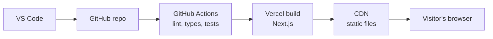

# Architecture

## 1. Overview
The portfolio is a static website. Pages are generated at build time by Next.js, then served as plain files from a CDN. Every push to `main` is checked by automated tests and then deployed.





## 2. Tech stack

| Layer | Choice | Why |
|---|---|---|
| Framework | Next.js with React | Widely used in startups, file-based routing, good SEO |
| Language | TypeScript (strict) | Catches mistakes before the site runs |
| Styling | Tailwind CSS | Fast to write, theme tokens for light/dark |
| Unit tests | Vitest | Fast, works well with TypeScript |
| End-to-end tests | Playwright | Real browser tests, including mobile viewports |
| Accessibility | axe | Automated accessibility checks |
| CI | GitHub Actions | Runs checks on every push and pull request |
| Hosting | Vercel (free plan) | Deploys from GitHub, preview link per pull request |

## 3. Decisions

### Static site vs server-rendered site
- Context: The portfolio has no logins and no user-submitted data. Its content only changes when I edit it.
- Decision: Build it as a static site. Next.js generates the pages at build time and a CDN serves the finished files.
- Why: Nothing needs to be computed per visitor, so no server or database is needed. It is fast, free to host and has very little to attack.
- Alternatives considered: A server-rendered site (needs a running server for no benefit) and a site with a database (nothing to store).

### Where the resume is stored
- Context: Recruiters need to download my resume in one click.
- Decision: Keep the resume as a PDF in the repo's `public/` folder and link to it.
- Why: It is versioned in Git, served by the CDN, and needs no backend. Updating it is a normal commit.
- Alternatives considered: A Google Drive link (I don't control it and it can break) and cloud file storage with a database (more than a single file needs).

### Where the site content lives
- Context: Projects and skills will change over time.
- Decision: Keep them in typed data files, separate from the UI components.
- Why: Adding a project means editing data, not UI code, and TypeScript catches mistakes.
- Alternatives considered: A CMS (overkill for one editor) and writing content directly inside components (hard to maintain).

## 3. Build time or browser?

| Feature | Where it runs | Why |
|---|---|---|
| Hero text | Build time | The same for every visitor |
| Project cards (content) | Build time | Comes from data files and never changes per visitor |
| Skill tree expand and collapse | Browser | Responds to clicks after the page loads |
| Project filter by tag | Browser | Responds to the visitor's selection |
| Light/dark theme toggle | Browser | Depends on the visitor's choice and device setting |
| Copy-email button | Browser | The clipboard needs a click from the visitor |
| Resume download link | Build time | A plain link to a file in `public/` |

## 4. Folder structure (proposed, to confirm in task 1.4)

```
portfolio/
├── app/              pages and layout
├── components/       reusable UI pieces
├── content/          projects and skills data
├── lib/              small helper functions
├── public/           resume PDF, images, favicon
├── tests/            unit and end-to-end tests
├── docs/             this document
└── .github/workflows/  CI pipeline
```

## 5. Testing strategy
- Unit tests for the data and filter logic.
- Component tests for the skill tree and theme toggle.
- End-to-end tests for page load, theme switch, project filter and a mobile viewport.
- Automated accessibility checks on every page.
- All tests run in CI, and a pull request cannot merge if they fail.

## 6. Deployment pipeline
Push to a branch, open a pull request, CI runs, Vercel builds a preview link, and I review it. After the merge to `main`, Vercel deploys to the live URL automatically.

## 7. Risks

| Risk | Plan |
|---|---|
| The site claims more than my projects prove | Keep skill levels honest and link every claim to real code |
| Scope grows and the site never ships | Stay inside the roadmap, and move extras to a later list |
| Free hosting limits change | Keep the site portable, since it is plain static files |
| Dependencies go out of date | Run updates on a schedule and let CI catch breakage |